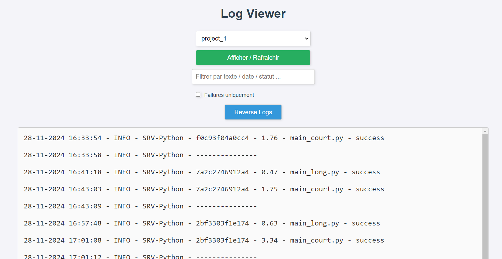

# Minimal Flask based logs frontend with basic filtering and sorting.

## Usage

- Clone repository.
- Enter some project paths in the `PROJECTS` variable located in `app.py`.
- Create a folder named `logs` inside the folder of your project and place your logs (ending in `.log`).
- Launch flask server
- Enjoy

